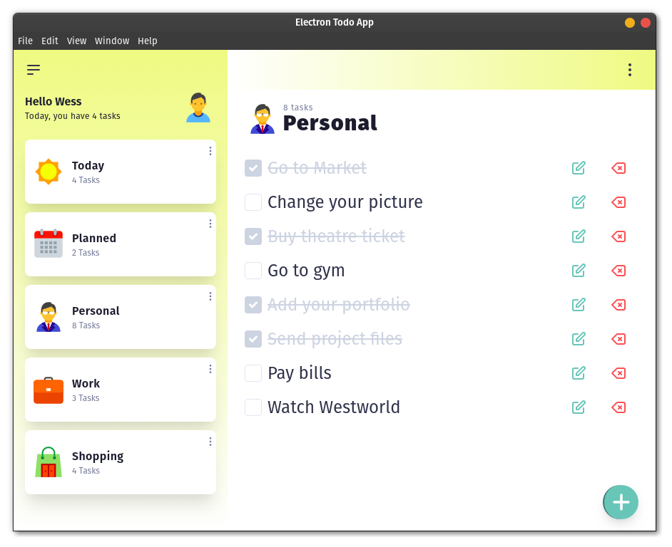

## Electron Todo App
A React Redux todo application built with Electron and create-react-app.




### Details
#### Build tools
- Electron
- Create React App
- Redux toolkit

#### Functionality
The main feature of the application is CRUD functionality for tasks

### Usage
To run locally:
- Clone the repository and install dependencies:
```bash
# install dependencies with yarn
yarn install

# or npm
npm install
```

- Build and run
```bash
# Build
yarn build:desktop

# Run
yarn start:desktop
```